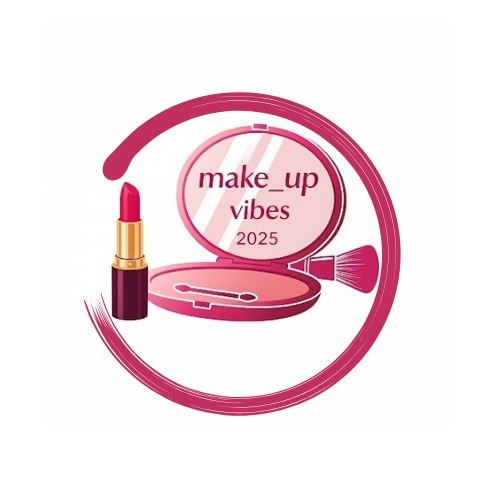

# 💄 MASGLO - Makeup Vibe 2025

<div align="center">
  
  
  ### ✨ Sitio Web Oficial para el Lanzamiento de la Nueva Colección ✨
  
  **Un evento único donde la creatividad y la inclusión se encuentran**
  
  [](https://dorodrig.github.io/MasgloLanzamiento/)
  [](https://reactjs.org/)
  [](https://www.typescriptlang.org/)
  [](https://tailwindcss.com/)
  [](https://vitejs.dev/)
</div>

---

## 🌟 **Descripción del Proyecto**

**Makeup Vibe 2025** es el sitio web oficial para el lanzamiento de la nueva línea de maquillaje de **MASGLO**. Desarrollado como proyecto académico para la materia de **Networking**, este sitio web promociona un evento exclusivo y permite la adquisición de entradas de manera elegante y moderna.

### 🎯 **Objetivos del Proyecto**
- Crear una experiencia web moderna y atractiva
- Promover la inclusión y diversidad en la belleza
- Facilitar la compra de entradas para el evento
- Demostrar habilidades en desarrollo web frontend

---

## 🚀 **Demo en Vivo**

### 🌐 [**Ver Sitio Web**](https://dorodrig.github.io/MasgloLanzamiento/)

---

## ✨ **Características Principales**

### 🎨 **Diseño y UI/UX**
- **Diseño moderno** con paleta de colores rosa y púrpura
- **Totalmente responsivo** para móviles, tablets y desktop
- **Navegación suave** con scroll animado
- **Gradientes elegantes** y efectos visuales atractivos
- **Tipografía moderna** con fuente Inter

### 🛍️ **Funcionalidades**
- **Sistema de entradas** con 3 tipos: General, VIP y Premium
- **Alertas personalizadas** con SweetAlert2 para confirmación de compras
- **Información del evento** detallada (fecha, lugar, incluye)
- **Showcase de productos** de la nueva línea Makeup Vibe
- **Información corporativa** sobre MASGLO
- **Newsletter** para suscripciones

### 🎪 **Secciones del Sitio**
- **🏠 Hero Section**: Presentación impactante con llamadas a la acción
- **💄 Productos**: Labiales, Paletas de Sombras y Base Inclusiva
- **📅 Evento**: Detalles del lanzamiento en Corferias, Bogotá
- **🎫 Entradas**: Sistema de selección y compra de tickets
- **🏢 Nosotros**: Historia y estadísticas de MASGLO
- **📞 Footer**: Contacto, redes sociales y newsletter

---

## 🛠️ **Tecnologías Utilizadas**

<div align="center">

| Frontend | Styling | Build Tools | Deployment |
|----------|---------|-------------|------------|
|  |  |  |  |
|  |  |  |  |

</div>

### 📦 **Dependencias Principales**
```json
{
  "react": "^19.1.1",
  "typescript": "~5.8.3",
  "tailwindcss": "^3.x",
  "sweetalert2": "^11.x",
  "animate.css": "^4.x"
}
```

---

## 🏁 **Instalación y Uso**

### 📋 **Prerrequisitos**
- Node.js 18+ 
- npm o yarn
- Git

### ⚡ **Instalación Rápida**

```bash
# 1. Clonar el repositorio
git clone https://github.com/dorodrig/MasgloLanzamiento.git

# 2. Navegar al directorio
cd MasgloLanzamiento

# 3. Instalar dependencias
npm install

# 4. Iniciar servidor de desarrollo
npm run dev

# 5. Abrir en navegador
# http://localhost:5173
```

### 🔧 **Scripts Disponibles**

```bash
npm run dev      # Servidor de desarrollo
npm run build    # Construir para producción  
npm run preview  # Vista previa de producción
npm run deploy   # Desplegar a GitHub Pages
npm run lint     # Verificar código con ESLint
```

---

## 🎨 **Paleta de Colores**

<div align="center">

| Color | Hex | Uso |
|-------|-----|-----|
| 🌸 **Rosa Principal** | `#ec4899` | Botones, acentos, iconos |
| 💜 **Púrpura Principal** | `#8b5cf6` | Gradientes, hover states |
| ⚪ **Fondo Claro** | `#fdf2f8` | Backgrounds suaves |
| 🖤 **Texto Principal** | `#1f2937` | Títulos y contenido |
| 🔘 **Texto Secundario** | `#6b7280` | Subtítulos y descripciones |

</div>

---

## 📂 **Estructura del Proyecto**

```
MasgloLanzamiento/
├── 📁 public/
│   ├── 📁 logo/
│   │   └── 🖼️ makeup_vibes_2025.jpeg
│   └── 🖼️ vite.svg
├── 📁 src/
│   ├── 📄 App.tsx          # Componente principal
│   ├── 🎨 App.css          # Estilos personalizados
│   ├── 🎨 index.css        # Estilos globales + Tailwind
│   └── 📄 main.tsx         # Punto de entrada
├── ⚙️ vite.config.ts       # Configuración de Vite
├── ⚙️ tailwind.config.js   # Configuración de Tailwind
├── ⚙️ postcss.config.js    # Configuración de PostCSS
├── ⚙️ tsconfig.json        # Configuración de TypeScript
└── 📖 README.md           # Este archivo
```

---

## 🎯 **Información del Evento**

### 📅 **Detalles del Lanzamiento**
- **📍 Lugar**: Centro de Convenciones Corferias, Bogotá
- **📅 Fecha**: Sábado, 15 de Marzo 2025  
- **🕕 Hora**: 6:00 PM - 10:00 PM
- **🎭 Tipo**: Evento de lanzamiento exclusivo

### 🎫 **Tipos de Entradas**

| Tipo | Precio | Incluye |
|------|--------|---------|
| **🎫 General** | $150.000 | Acceso al evento, Kit básico, Cóctel |
| **⭐ VIP** | $300.000 | Todo lo anterior + Kit completo + Sesión personalizada + Meet & greet |
| **💎 Premium** | $500.000 | Todo lo anterior + Acceso backstage + Colección completa + Cena privada |

---

## 👥 **Equipo de Desarrollo**

<div align="center">

### 👨‍💻 **Desarrollador**
**Estudiante**  
*Noveno Semestre*  
*Materia: Networking*

[](https://github.com/dorodrig)

</div>

---

## 🎓 **Contexto Académico**

### 📚 **Información del Curso**
- **📖 Materia**: Networking
- **📅 Semestre**: Noveno Semestre - 2025
- **🎯 Objetivo**: Crear un sitio web para promocionar un evento empresarial
- **🏢 Empresa**: MASGLO - Línea Makeup Vibe 2025

### 🏆 **Competencias Desarrolladas**
- ✅ Desarrollo Frontend Moderno
- ✅ Diseño Responsivo y UX/UI
- ✅ Gestión de Proyectos con Git
- ✅ Deployment y DevOps
- ✅ Marketing Digital y Branding

---

## 🤝 **Contribuciones**

¡Las contribuciones son bienvenidas! Si tienes ideas para mejorar el proyecto:

1. 🍴 Fork el proyecto
2. 🌿 Crea una branch (`git checkout -b feature/AmazingFeature`)
3. 💾 Commit tus cambios (`git commit -m 'Add some AmazingFeature'`)
4. 🚀 Push a la branch (`git push origin feature/AmazingFeature`)
5. 🔄 Abre un Pull Request

---

## 📞 **Contacto**

<div align="center">

### 📧 **MASGLO Makeup Vibe 2025**

📧 **Email**: info@masglo.com  
📱 **Teléfono**: +57 (1) 234-5678  
📍 **Ubicación**: Bogotá, Colombia  

### 🌐 **Redes Sociales**
[](#)
[](#)
[](#)

</div>

---

## 📝 **Licencia**

Este proyecto es desarrollado con fines **académicos** para la materia de Networking.

```
📚 Proyecto Académico - Universidad
🎓 Uso educativo y demostrativo
⚠️ No para uso comercial
```

---

<div align="center">

### 💝 **¡Gracias por visitar nuestro proyecto!**

**Hecho con ❤️ y mucho ☕ para la materia de Networking**

[](https://github.com/dorodrig/MasgloLanzamiento)

</div>

---

<div align="center">
  <sub>
    🌟 <strong>MASGLO</strong> - Creando belleza y confianza desde 1995 🌟
  </sub>
</div>